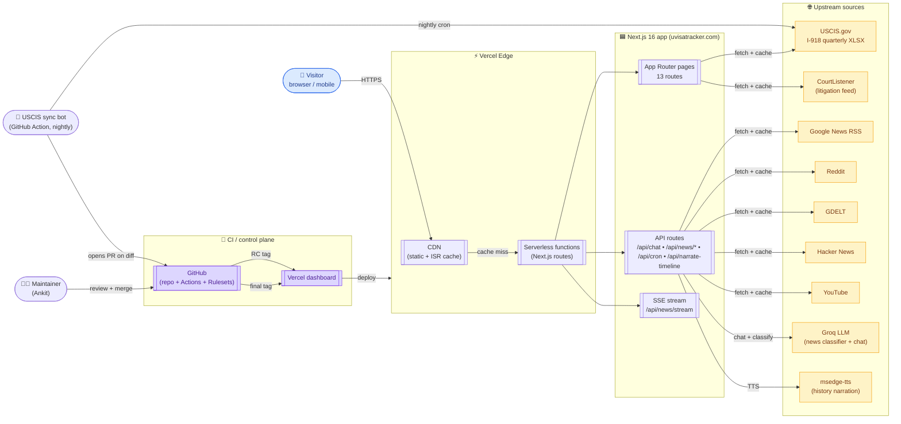
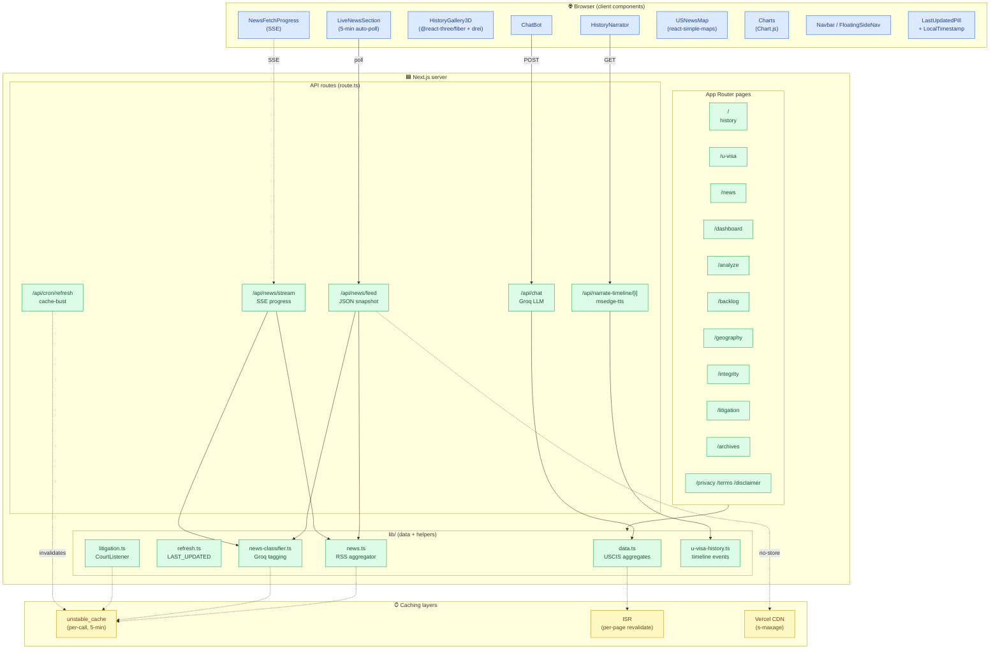
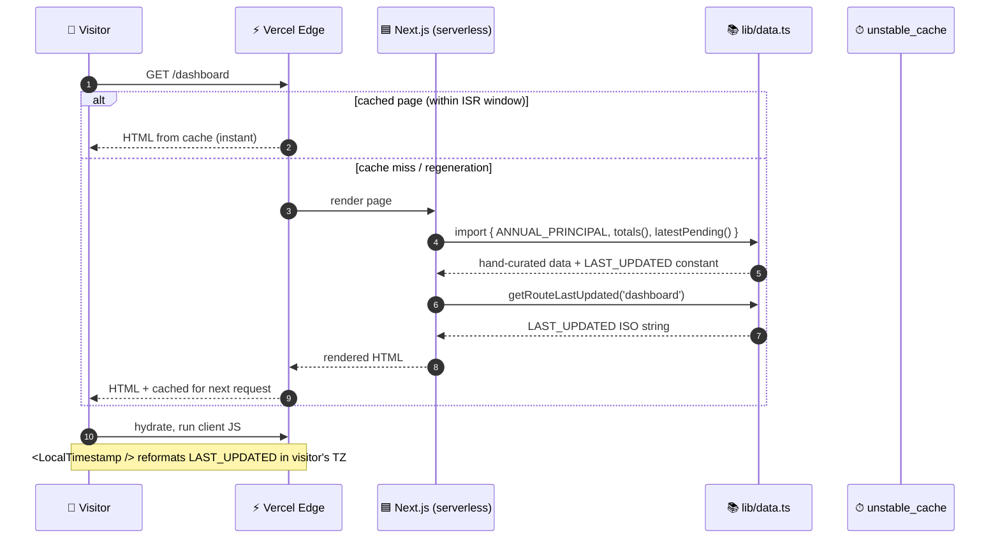
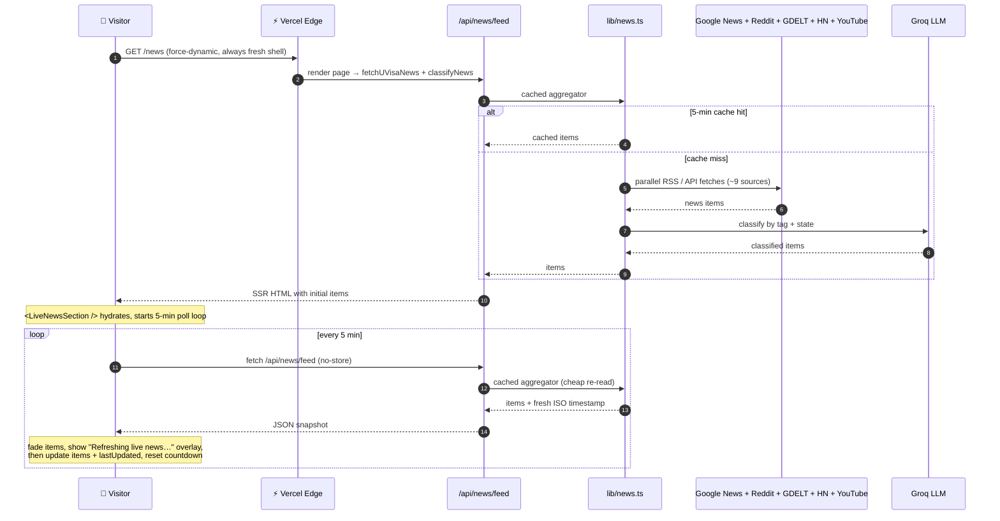

# U Visa Tracker — Architecture & Showcase

> A public-data dashboard for the U nonimmigrant visa (USCIS Form I-918). Aggregate filings, approvals, denials, multi-decade backlog, and live news — all from publicly published sources, with individual petitioner data legally protected and never shown.

🌐 **Live:** https://uvisatracker.com  ·  📦 **Source:** https://github.com/ankitcts/u-visa-tracker  ·  🚀 **Latest:** [v1.5.0](https://github.com/ankitcts/u-visa-tracker/releases/latest)

---

## Table of contents

1. [System design (C4 context)](#1-system-design--c4-context)
2. [Architecture (component layers)](#2-architecture--component-layers)
3. [Use case diagram](#3-use-case-diagram)
4. [Data flow — request to render](#4-data-flow--request-to-render)
5. [Release pipeline](#5-release-pipeline)
6. [Tech stack](#6-tech-stack)
7. [Key design decisions](#7-key-design-decisions)
8. [Quality bar](#8-quality-bar)

---

## 1. System design — C4 context

High-level view of who talks to what. Browser → Vercel edge → Next.js → external sources. All diagrams are Mermaid; GitHub renders them natively, click-pan-zoom in the rendered view.

---

## 2. Architecture — component layers

Inside the Next.js app: how routes, server components, client components, libraries, and external dependencies are wired.

---

## 3. Use case diagram

Actors and what they can do. UML-style use cases mapped to actual features.

```mermaid
flowchart LR
  visitor(["👤 Visitor"])
  maintainer(["🧑‍💻 Maintainer"])
  bot(["🤖 USCIS sync bot"])
  cron(["⏱ Vercel Cron"])

  subgraph PublicUseCases["🌐 Public-visitor use cases"]
    direction TB
    uc1(("Browse aggregate stats<br/>(dashboard / backlog / geography)"))
    uc2(("Read U-visa history aloud<br/>(narrator + Remotion video)"))
    uc3(("Filter cases by FY / state<br/>(/analyze)"))
    uc4(("Read live news<br/>(/news, 5-min refresh)"))
    uc5(("Chat about the U-visa<br/>(Groq-powered)"))
    uc6(("Search archives<br/>(/archives)"))
    uc7(("View qualifying crimes<br/>(/u-visa)"))
    uc8(("View landmark litigation<br/>(/litigation)"))
  end

  subgraph MaintainerUseCases["🛠 Maintainer use cases"]
    direction TB
    mc1(("Open PR via feature/bug/hotfix branch"))
    mc2(("Review auto-data-sync PR"))
    mc3(("Cut RC → preview deploy"))
    mc4(("Promote RC → production"))
    mc5(("Audit branch-protection"))
  end

  subgraph AutomatedUseCases["⚙️ Automated use cases"]
    direction TB
    ac1(("Detect new USCIS XLSX<br/>(SHA diff)"))
    ac2(("Auto-PR fresh data.ts"))
    ac3(("Bust daily-refresh cache"))
    ac4(("Deploy on RC tag"))
    ac5(("Deploy on final tag"))
  end

  visitor --- uc1 & uc2 & uc3 & uc4 & uc5 & uc6 & uc7 & uc8
  maintainer --- mc1 & mc2 & mc3 & mc4 & mc5
  bot --- ac1 & ac2
  cron --- ac3
  maintainer -.triggers.-> ac4 & ac5

  classDef visitor fill:#dbeafe,stroke:#2563eb,color:#1e3a8a
  classDef maint fill:#fce7f3,stroke:#db2777,color:#831843
  classDef auto fill:#fef9c3,stroke:#ca8a04,color:#713f12
  class visitor visitor
  class maintainer maint
  class bot,cron auto
```

---

## 4. Data flow — request to render

What happens when a visitor opens `/dashboard`. Sequence diagram covering the cache layers.

For `/news`, the flow includes auto-refresh polling:

---

## 5. Release pipeline

Branch → PR → merge → RC → preview → final → production. Enforced by GitHub Rulesets + a tracked pre-push hook + a CI guard.

```mermaid
flowchart LR
  start([Code change]) --> branch{"Branch type?"}
  branch -->|new feature| feat["feature/&lt;slug&gt;"]
  branch -->|defect| bug["bug/&lt;slug&gt;"]
  branch -->|prod fix| hot["hotfix/&lt;slug&gt;"]

  feat & bug & hot --> commit[Commit]
  commit --> push["git push origin &lt;branch&gt;"]
  push --> pr["Open PR via gh pr create"]
  pr --> review{Review}
  review -->|approved| merge["gh pr merge --squash<br/>(branch retained)"]
  merge --> main["main"]

  main --> ask["Ask user:<br/>cut RC?"]
  ask -->|yes| rc["git tag v1.x.y-rc.N"]
  rc --> rcWf[".github/workflows/deploy-rc.yml"]
  rcWf --> preview["Vercel preview<br/>https://u-visa-tracker.vercel.app"]
  preview --> verify{User verifies}
  verify -->|approved| final["git tag v1.x.y"]
  final --> relWf[".github/workflows/deploy-release.yml"]
  relWf --> prod["Vercel production<br/>https://uvisatracker.com"]

  subgraph Guards["🛡 main-branch protection (3 layers)"]
    direction TB
    g1["GitHub Ruleset<br/>(server-side, no bypass)"]
    g2[".githooks/pre-push<br/>(local block, opt-in)"]
    g3[".github/workflows/no-direct-push-to-main.yml<br/>(CI guard)"]
  end

  push -.checked by.-> g2
  main -.protected by.-> g1 & g3

  classDef branch fill:#dbeafe,stroke:#2563eb
  classDef tag fill:#fef9c3,stroke:#ca8a04
  classDef env fill:#dcfce7,stroke:#16a34a
  classDef guard fill:#fce7f3,stroke:#db2777
  class feat,bug,hot,main branch
  class rc,final tag
  class preview,prod env
  class g1,g2,g3 guard
```

---

## 6. Tech stack

Click any badge to jump to its docs.

### Framework & language

### Styling & UI

[-0055FF?style=for-the-badge)](https://motion.dev)

### Data viz

### Backend services

[-FF6E37?style=for-the-badge)](https://console.groq.com)

### Data sources

### Testing & quality

### CI / CD

### Counts at a glance

| | |
| --- | --- |
| **Routes** | 13 pages + 5 API routes |
| **Components** | 40+ React components |
| **Tests** | 64 jest + 44 playwright = 108 passing |
| **Workflows** | `deploy-rc.yml` · `deploy-release.yml` · `sync-uscis.yml` · `no-direct-push-to-main.yml` |
| **Releases shipped** | 8 (v0.2.0 → v1.5.0) since project went public |

---

## 7. Key design decisions

<strong>Why hand-curated data.ts (with auto-PR sync) instead of a database?</strong>

The dashboard renders aggregate USCIS statistics that update at most once per quarter. A database would be operational overhead with ~zero benefit. Instead:

- `src/lib/data.ts` is hand-edited from the latest USCIS XLSX
- `USCIS_FILE_VERIFIED.sha256` anchors the data to a specific file
- `scripts/sync-uscis.mjs` runs nightly via GitHub Action — fetches the canonical XLSX, compares SHA, and **opens an auto-PR with regenerated arrays** if anything changed
- The maintainer reviews + merges, then cuts a release

This gives provenance (every data change goes through a reviewed PR), zero infrastructure (no DB), and high integrity (SHA-pinned source files).

<strong>Why split RC tags → preview vs final tags → production?</strong>

Earlier the same workflow deployed RC tags directly to production. That left no chance to verify a release candidate on a real Vercel environment before users saw it.

Now:
- `v*-rc.*` → `deploy-rc.yml` → Vercel **preview** → aliased to `https://u-visa-tracker.vercel.app`
- `v[0-9]+.[0-9]+.[0-9]+` → `deploy-release.yml` → Vercel **production** → `https://uvisatracker.com`

Maintainer verifies on the stable preview alias, then cuts the matching final tag to ship.

<strong>Why three layers of main-branch protection?</strong>

GitHub Rulesets (server-side) require Pro on private repos. To get real prevention without paying, three free defenses run in parallel:

1. **GitHub Ruleset** (added after the repo went public) — server-side, no bypass
2. **`.githooks/pre-push`** — local block, opt-in via `git config core.hooksPath .githooks`
3. **`.github/workflows/no-direct-push-to-main.yml`** — CI guard that fails any push to main whose head commit isn't a PR squash-merge

Defense in depth. Even if one layer is bypassed (e.g. local hook from a fresh clone), the others catch it.

<strong>Why force-dynamic on /news instead of ISR?</strong>

`/news` was previously cached for 5 min via `revalidate = 300`. Visitors got the same HTML the whole window — the `<NewsFetchProgress />` Suspense loader never showed except on the very first cold render.

Switching to `dynamic = 'force-dynamic'` lets Suspense stream the loader on every visit. Upstream feed fetches in `lib/news.ts` are still cached via `unstable_cache` (5-min TTL), so per-request rendering does NOT translate to per-request upstream hits.

<strong>Why pill timestamp = data vintage, not cache-bust time?</strong>

The Last-updated pill on every data page used to show `new Date()` cached per-route. After a deploy, the cache was cold and regenerated to "now" — so the pill effectively showed the deploy time, not the data vintage.

Now the pill sources from `LAST_UPDATED` in `data.ts` directly. That's bumped (a) by hand when a USCIS reconciliation is committed, or (b) automatically by the auto-sync workflow. Honest signal of "when did the underlying numbers last change".

<strong>Why msedge-tts for narration instead of OpenAI / ElevenLabs?</strong>

The "Read the history aloud" button synthesises 14 timeline events end-to-end. msedge-tts uses Microsoft Edge's TTS endpoint via WebSocket — free, no API key, the same Aria voice the Remotion intro video uses. CDN caches the resulting MP3 per event, so first-listener-per-region pays the synthesis cost once, everyone after gets bytes.

---

## 8. Quality bar

- **Compliance:** site only ever shows aggregate, publicly-published statistics — individual petitioner info is protected under 8 U.S.C. § 1367. Encoded in `CLAUDE.md` and enforced at the data layer.
- **Tests:** 64 jest (data, history, litigation, integrity, archive sources, AnnualTable, StatCard, DisclaimerBanner, Footer, Navbar, narrate-timeline route) + 44 playwright (chromium-desktop + mobile-iphone, all 16 routes return 200 + assert h1) = 108 passing.
- **Build:** clean on Next 16 + Turbopack, TypeScript strict, no ESLint errors.
- **Pipeline:** every push to main goes through a reviewed PR; every production deploy is gated behind preview verification at a stable URL.
- **Source provenance:** every aggregate cell in `data.ts` traces back to a SHA-pinned USCIS XLSX whose URL is documented in `USCIS_FILE_VERIFIED`.

---

Generated as part of the v1.6.0 release. See [release notes](https://github.com/ankitcts/u-visa-tracker/releases) for the full changelog.
